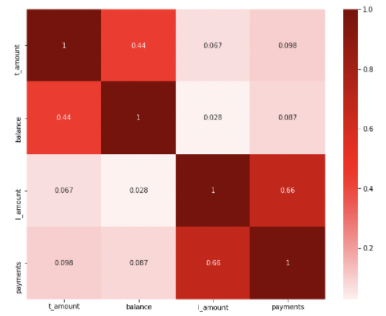
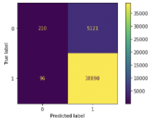
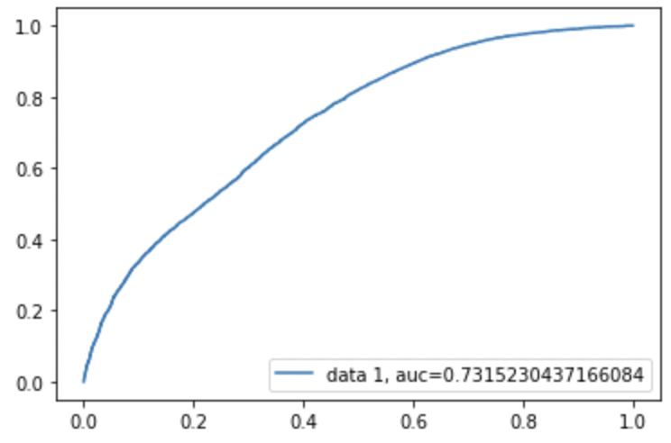

# Bank logistic regression walkthrough 💵 💶 
## Class Project Bank Logistic Regression Walkthrough Live

### Table of Content
- Project Brief
- Data
- Tools
- Visualization
- Key Take Aways

## Project Brief
**Scenario:** in this project we will attempt to predict the loan status using a database bank.

**Challenge:** use the given data set to find out what are the best clients to give a loan.

**Problem:** Can we build a machine learning model that predicts if our customer accepts or declines the credit card offer?

## Data
With the data we had we first run SQL query into DataFrame in JupyterNotebook.
Once in JupyterNotebook we did the following steps:
- Data cleaning
- Categoricals cleaning
- Check correlations for numerical columns
- Split data into num and cat for pre processing
- Modelling and evaluating the modelling

## Tools

We use the following tools to get the final result:
- MySQL: started with the independent task of completing the SQL queries
- JupyterNotebook: clean and manage de data
- Tableau: visualization of the data results

## Visualization
 

